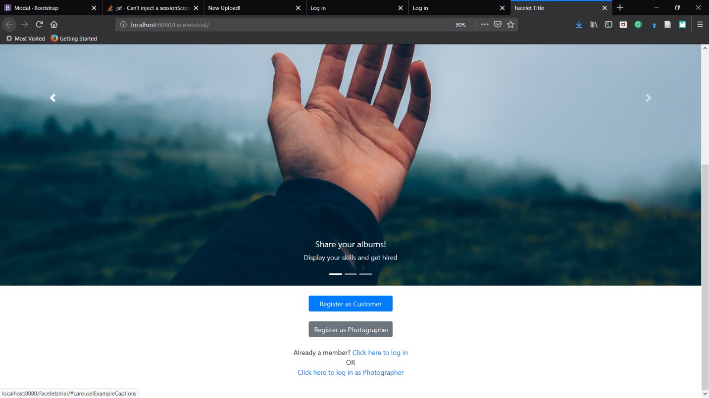

# Photolancing-HTML-JSF

### The Application:	
The project involved creating a website serving as a platform for freelancing photographers. Photographers as well as potential customers are required to register to become a member. Once a member, they would have to log in every time in order to use the website’s services. Thus, we will have two sets of web pages:
i)	A photographer’s website
ii)	A customer’s website
A slightly more detailed idea about the set of services offered by each of the different user’s website is given below.

#### Photographer’s website:
In general, the photographer will be able to create and update his ‘portfolio’. This will include their essential details such as name, DOB, nationality (if required), address, education, experience and service charges. In addition, the photographer can upload albums demonstrating his sample photos (for example, an album for pictures he captured at a wedding and another album for pictures he captured on a trip to Athens). Furthermore, their website will also allow the photographer to view a list of all the customers they have had in the past, and their personal history with those customers (number of times served, what the project was, et.al). Lastly, if contacted by a customer for a reservation, the photographer may choose to accept or decline the customer’s request (the reservation would mainly include the address, date(s), time and a proposed payment amount – acceptance and rejection of the reservation is solely dependent on the photographer’s personal appeal towards the project and is not subject to any other factors). If the photographer accepts the reservation, the project is added to their history with that particular customer.

#### Customer’s website:
The customer’s website will be different from the photographer’s website. The customer will have a ‘profile’ including their essential details too, such as name, DOB, nationality (if required), address, et. al. The customer will be able to browse for photographers. They can either view the entire list of photographers, or filter their search based on the photographer’s name, address, service charge range, etc. The customers can also view the photographer’s details, their albums, and their personal history with the given photographer (if they have worked together earlier). Finally, the customer will be able to contact the photographer and make reservations with the photographer for a given date(s) and propose a payment amount. If accepted by the photographer, the given project will be added to the history.

## Installation
In netbeans, create a database with the following credentials:  
Database name: DB  
User: a  
Password: b  
After creating the database, execute the photofreelancing.sql file in the *execute command* of the database.  

Once the database is ready, run the index.html file from the project. The website is now live on your network and your machine is the server.

## Usage
Please follow the *Architecture and Page Flow* section of the report to understand the functioning of the websit

